# 🍽️ Smart Eating Booking System

A smart restaurant booking platform designed to bring restaurant discovery, table reservations, menu information, dietary transparency, and event discovery together in one system.

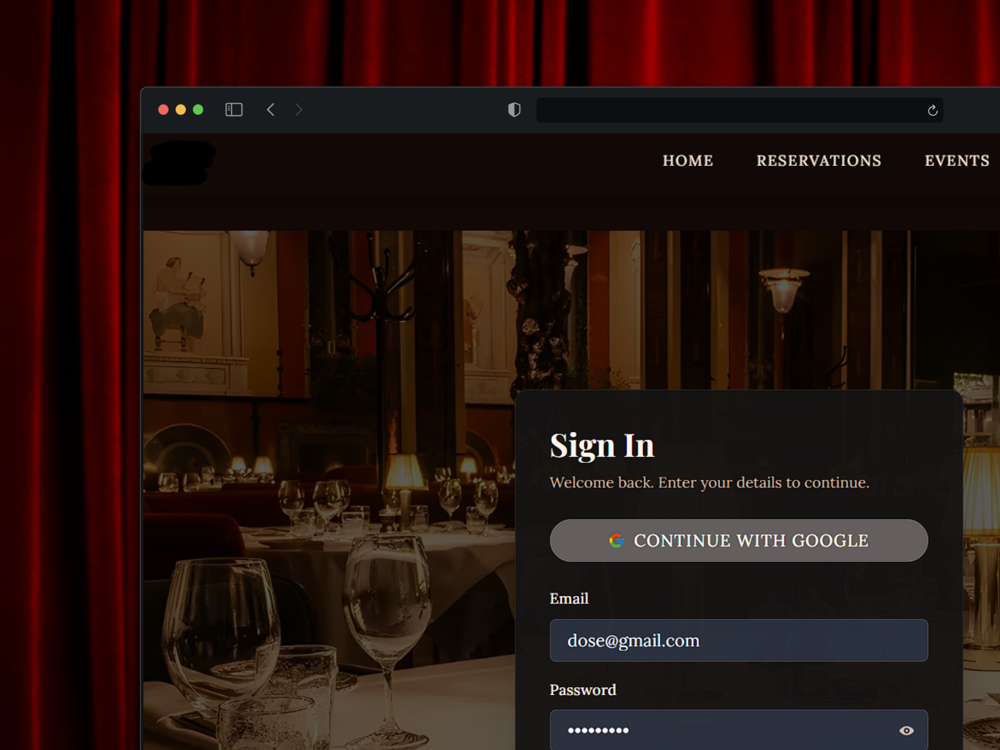

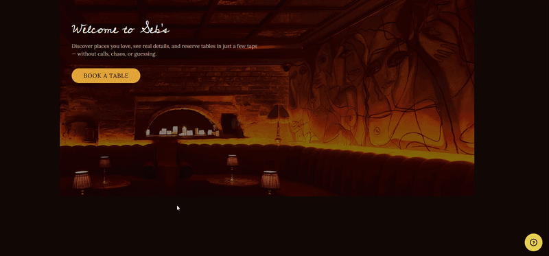

## System Overview

The system is designed around three main user roles:

### Customer
- Create an account and sign in using email or Google Sign-In
- Discover and explore restaurants
- View restaurant information, menus, locations, opening hours, social media, and table layouts
- View food ingredients and allergen information
- Explore interactive restaurant table layouts
- Select and reserve tables
- Provide seating preferences, allergy information, and special occasions
- Browse and book restaurant events through an event calendar
- Manage profile information and bookings
- View booking countdown timers

### Restaurant Owner / Staff
- Register and manage restaurant information
- Create and manage interactive restaurant table layouts
- Manage tables and table availability
- Manage menus and restaurant events
- Monitor customer bookings and reservation status
- View customer booking information, preferences, allergies, and special requests
- Monitor restaurant activity

### Smart Eating Booking System Admin Management
- Review newly registered restaurants
- Review submitted restaurant information and CR details
- Verify restaurant information before approval
- Accept or decline restaurant registration requests
- Monitor registered and active restaurants
- Manage platform accounts and access
- Monitor bookings and platform activity
- Review system statistics and analytics
- Help maintain the quality and integrity of the platform

## Key Features

### Interactive Table Reservation

Customers can explore restaurants through interactive floor layouts and select available tables before making a reservation.

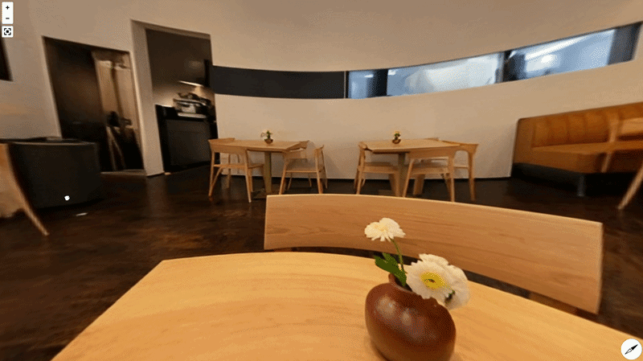

### Restaurant Discovery

Restaurant pages provide customers with detailed information including menus, food information, location, opening hours, social media accounts, and available table layouts.

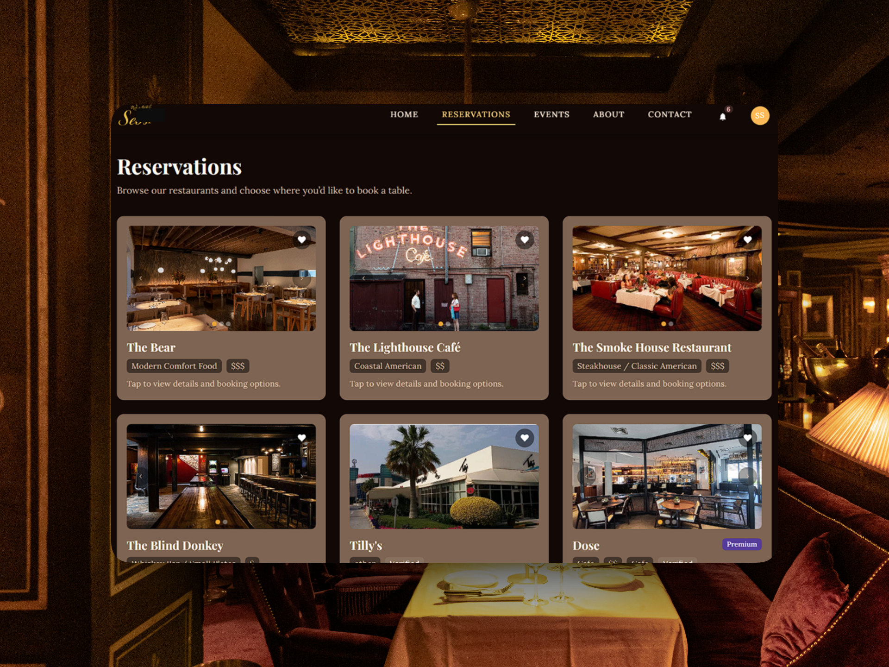

### Booking System

Customers can select their preferred date, time, guests, table, and booking preferences while providing additional information such as allergies and special occasions.

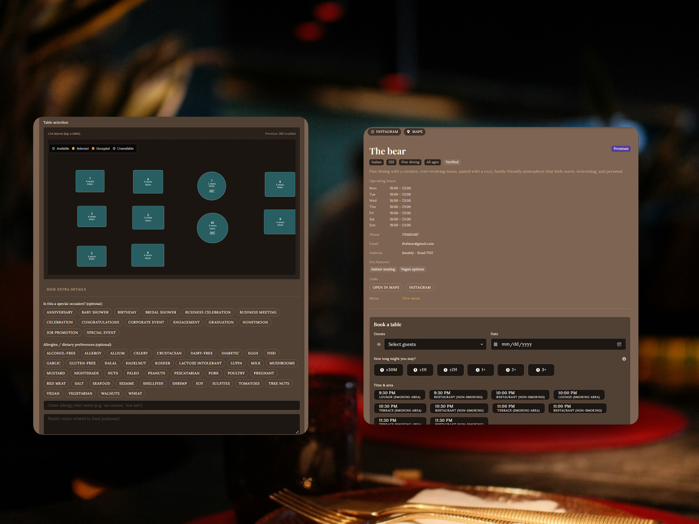

### Booking Timer

A booking countdown timer helps customers keep track of their active reservation.

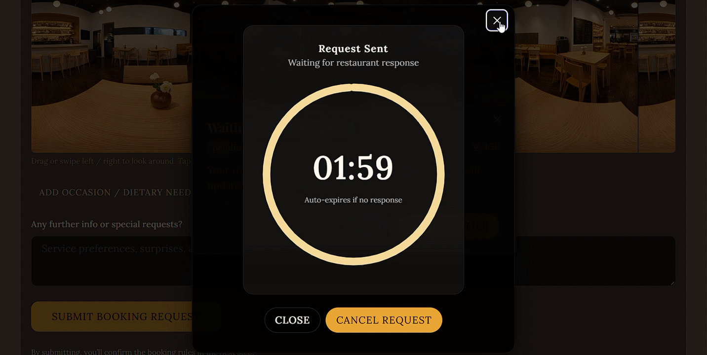

### Restaurant Events

Customers can browse upcoming restaurant events, view event details, and make event bookings through the event calendar.

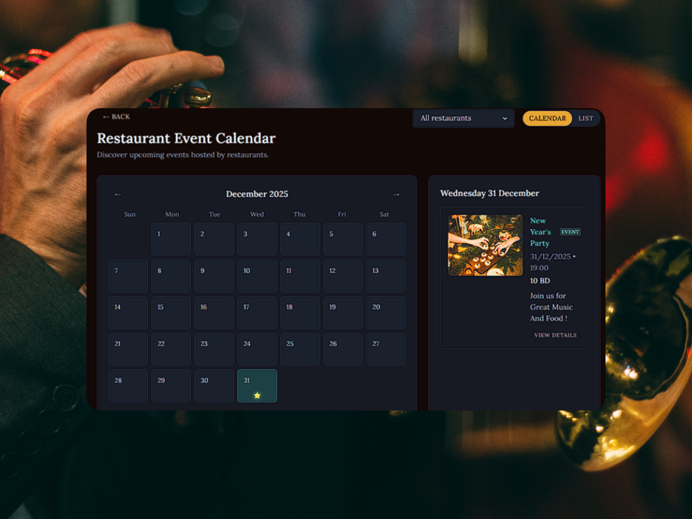

### Restaurant Management

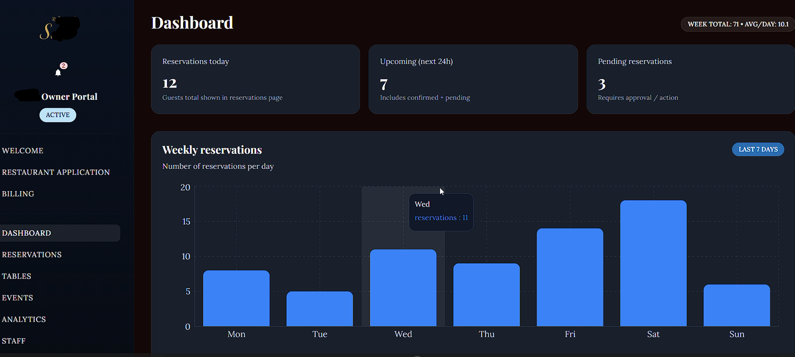


Restaurant owners and staff can manage:

- Restaurant registration and information
- Table availability
- Interactive floor-plan layouts
- Menus and events
- Customer bookings and reservation status
- Customer preferences and special requests
- Restaurant activity

### Restaurant Table Layout Builder

Restaurant staff can create and manage their restaurant's floor plan using draggable table and layout components.

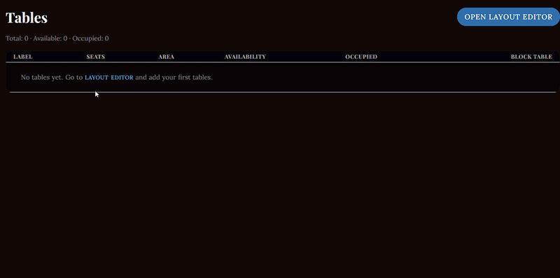

### Smart Eating Booking System Admin Management

The platform includes a dedicated administration area for managing restaurant registrations, approvals, platform activity, accounts, bookings, and system information.

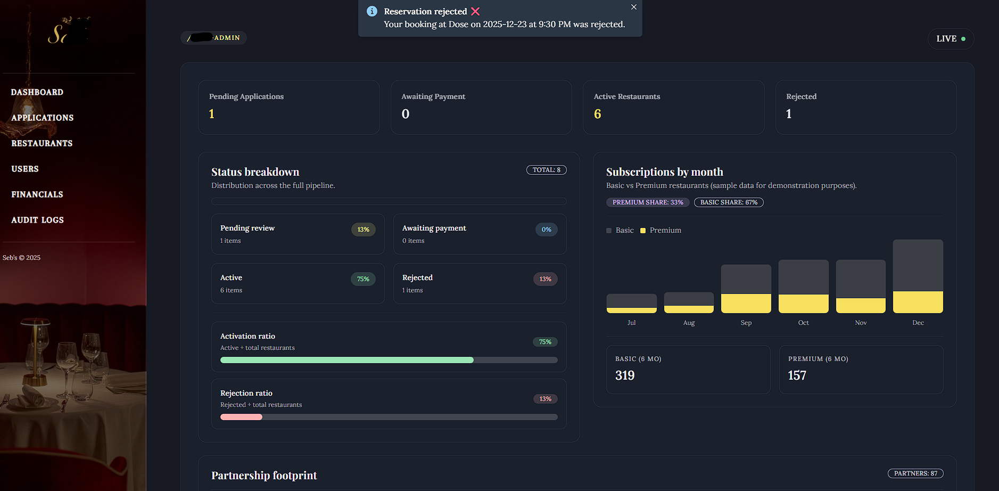

### Premium Analytics

The system includes a premium analytics area providing additional visual insights into reservations, activity, and platform data.

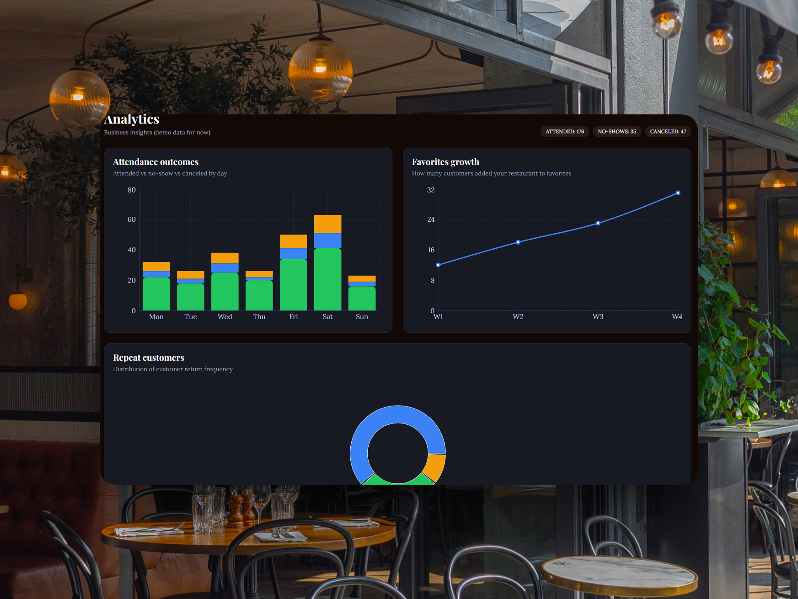

## Responsive Design

The system is built as a responsive web application that adapts to desktop, tablet, and mobile screen sizes.

The project structure was also developed with future expansion toward a dedicated mobile application in mind.


## Technologies Used

### Front-End

- React.js
- React Router DOM
- Chakra UI
- Emotion
- Framer Motion
- React Icons
- Recharts
- React-based draggable/resizable layout components

### Back-End & Database

- Firebase Authentication
- Firebase Realtime Database

### Design & Development Tools

- Figma
- Vite
- Visual Studio Code


## My Contribution


This project was developed as my university graduation project.
I independently worked across the full project lifecycle, from developing the initial concept and planning the system to designing the interface, creating the visual theme and colour palette, developing the front-end and back-end functionality, integrating Firebase services, implementing the different user roles and features, and testing the system.

The project was developed as a full-stack web application, with responsibility for the overall system structure, UI/UX design, implementation, and functionality.

## Project & Repository Notes

This repository is a public portfolio version of my university graduation project.

The project is presented for demonstration and portfolio purposes. Private credentials, sensitive information, and other non-public resources are not included in this repository.

Some features may depend on external services or configuration that are not included in the public version. As a result, certain functionality may not be fully available when running the project locally.

The screenshots and GIF demonstrations in this README showcase the application's implemented features and user interface.

## Running the Project Locally

### Requirements

- Node.js
- npm

### Installation

```bash
npm install
